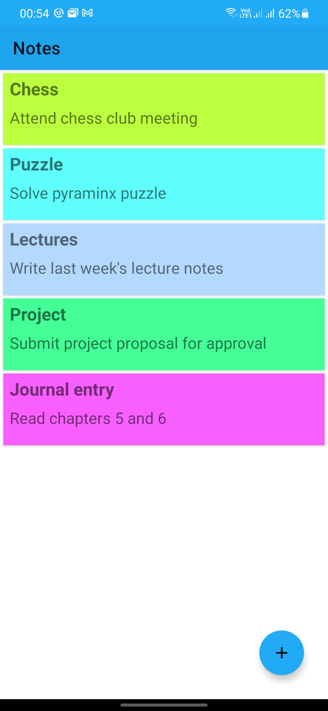
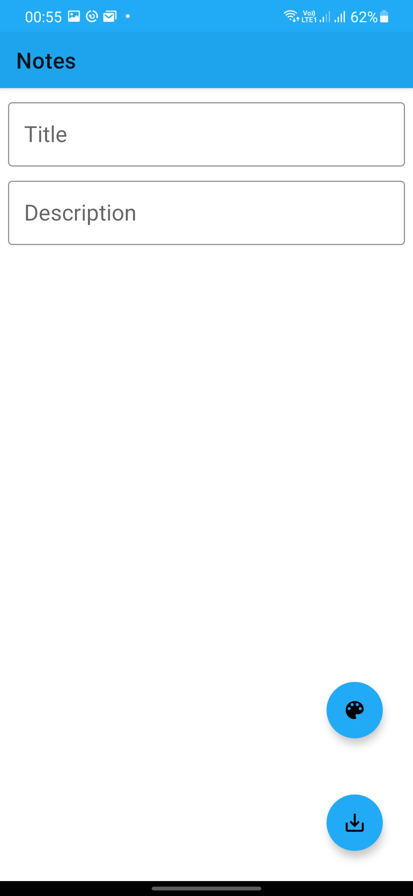
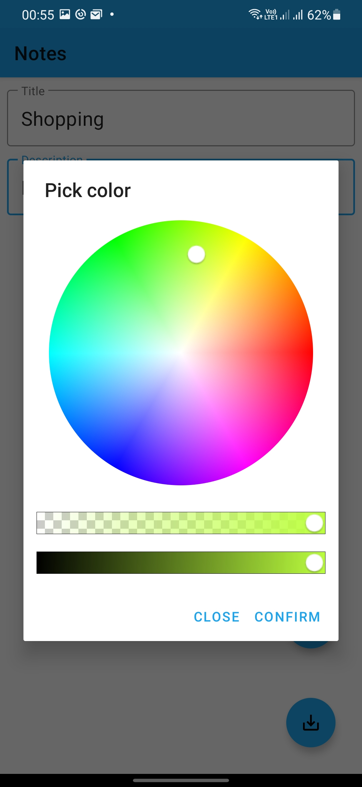
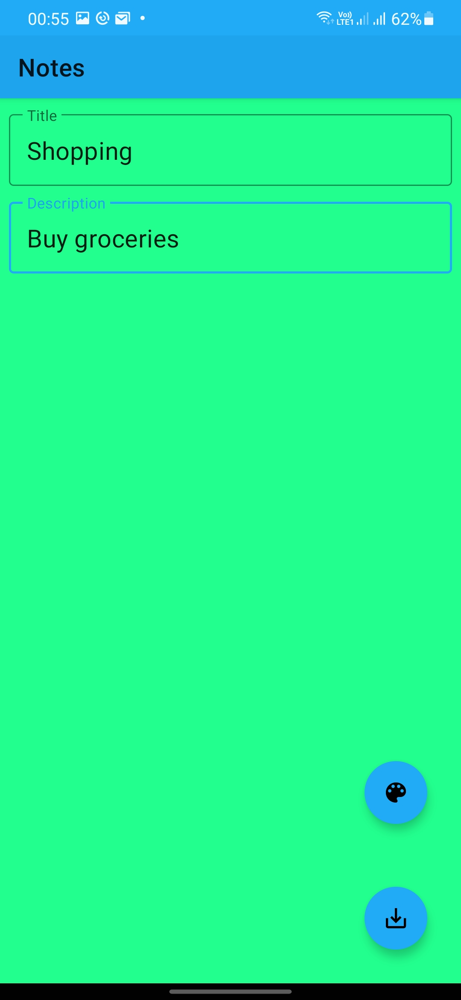
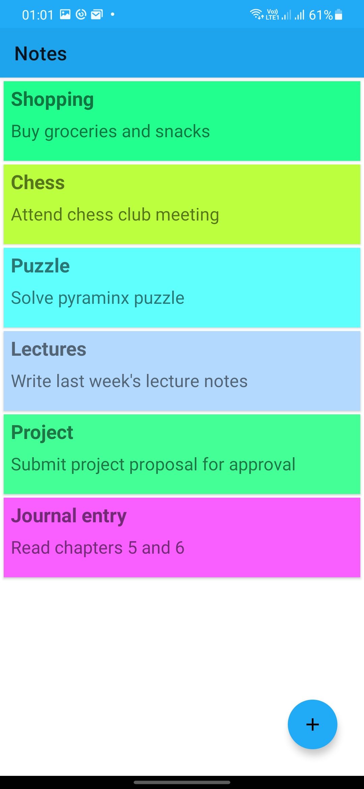
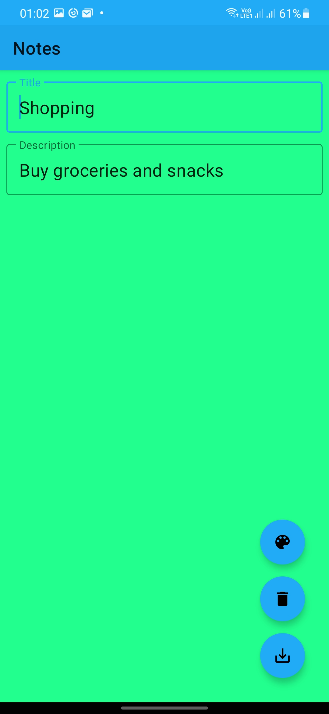

## Notes

A customizable android notes app built using MVVM architecture pattern 

Min Api Level: 21 [Android 5.0](https://developer.android.com/studio/releases/platforms)

Build System : [Gradle](https://gradle.org/)

## Screenshots

|  |  |  |
|---|---|---|
|  |  |  |

## Libraries and plugins

- [Navigation](https://developer.android.com/guide/navigation#:~:text=Android%20Jetpack's%20Navigation%20component%20helps,an%20established%20set%20of%20principles.) -  Android Jetpack's Navigation component helps you implement navigation, from simple button clicks to more complex patterns, such as app bars and the navigation drawer. The Navigation component also ensures a consistent and predictable user experience by adhering to an established set of principles.
- [Room](https://developer.android.com/training/data-storage/room) - The Room persistence library provides an abstraction layer over SQLite to allow for more robust database access while harnessing the full power of SQLite.
- [Safe Args](https://developer.android.com/guide/navigation/navigation-pass-data#Safe-args) - a Gradle plugin that provides type safety when navigating and passing data between navigation destinations.
- [Timber](https://github.com/JakeWharton/timber) - 🌳A logger with a small, extensible API which provides utility on top of Android's normal Log class.
- [ColorPickerView](https://github.com/skydoves/ColorPickerView) - 🎨 Android colorpicker for getting colors from any images by tapping on the desired color.
